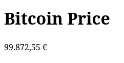

# Rust Bitcoin lib

This lib fetches the last bitcoin price from a service _https://blockchain.info/ticker_ and displays it on the page:

## Build

> $ cargo build

## Build with wasm-pack

> $ wasm-pack build --target web

## Nginx

Start NGINX:

> $ sudo nginx -c ~/dev/rust-bitcoin-lib/nginx.conf

NGINX stoppen:

> $ sudo nginx -s stop
